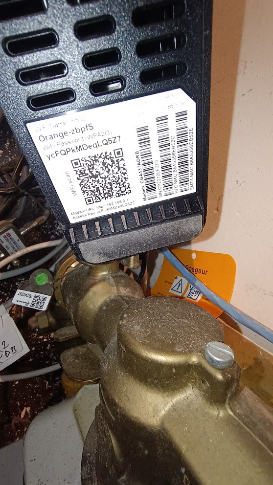

---

# **Minecraft Server Map op een Website & Server op een Domeinnaam**  

in deze guide leer je hoe je een live map van je Minecraft-server op een website zet en hoe je je server bereikbaar maakt met een domeinnaam.  

---  

## **🌍 Map op Website (BlueMap installeren)**  

We gaan BlueMap installeren. Dit is een plugin die een live kaart maakt van je Minecraft-wereld en die op een website zet.  

### **🔹 Stap 1: BlueMap downloaden en installeren**  

1. **Download BlueMap**  
   - Ga naar deze link: [BlueMap releases](https://github.com/BlueMap-Minecraft/BlueMap/releases).  
   - Kies de juiste versie:  
     - **Paper** → Voor een Paper-server.  
     - **Forge** → Voor een Forge-server.  
     - **Fabric** → Voor een Fabric-server.  
     - **Spigot/Bukkit** → Voor een Spigot- of Bukkit-server.  

2. **Gooi de plugin in de juiste map**  
   - Het `.jar`-bestand moet in de **"plugins"**-map (voor Paper/Spigot/Bukkit).  
   - Of in de **"mods"**-map (voor Forge/Fabric).  

3. **Start je server opnieuw op.**  
   - Dit zorgt ervoor dat BlueMap zijn config-bestanden aanmaakt.  

---

### **🔹 Stap 2: BlueMap instellen**  

1. **Ga naar de configuratiebestanden**  
   - Voor Paper/Spigot/Bukkit: **"plugins/BlueMap"**  
   - Voor Forge/Fabric: **"config/bluemap"**  

2. **Open `core.conf` en pas dit aan**  
   - Zoek de regel:  
     ```yaml
     accept-download: false
     ```  
   - Zet dit op **true** zodat BlueMap extra bestanden kan downloaden voor betere visuals.  

3. **Open `webserver.conf` en schrijf dit op**  
   - Zoek de regel met de poortinstelling, deze ziet er zo uit:  
     ```yaml
     port: 8100
     ```  
   - **Noteer dit nummer!** Je hebt dit later nodig.  

4. **(Optioneel) Meer instellingen aanpassen**  
   - Wil je de map anders weergeven of de renderkwaliteit veranderen? Check dan:  
     👉 [BlueMap Configuratie](https://bluemap.bluecolored.de/wiki/Configuration)  

5. **Herstart je server of voer het commando uit:**  
   ```
   /bluemap reload
   ```  

---

### **🔹 Stap 3: Map checken in je browser**  

1. **Open je browser.**  
2. **Typ dit in de adresbalk:**  
   ```
   http://<IP van je Minecraft-server>:<poortnummer>
   ```
   - **Vervang `<IP van je Minecraft-server>`** met het IP-adres van je server.  
   - **Vervang `<poortnummer>`** met het nummer dat je net noteerde.  

Als alles goed staat, zie je nu je Minecraft-wereld op de site. 🎉  

---

## **🛠️ Minecraft Server op Domeinnaam**  

Nu het lastige stuk: je Minecraft-server bereikbaar maken met een domeinnaam. We gaan poorten openzetten op je **modem**.  

---

### **🔹 Stap 1: Je modem instellen**  

1. **Open CMD in Windows**  
   - Druk op `Win + R`, typ `cmd`, en druk op **Enter**.  

2. **Voer het volgende commando uit:**  
   ```
   ipconfig
   ```
   - Zoek naar **"Default Gateway"**.  
   - Noteer het IP-adres dat daar staat.  

3. **Open je modeminstellingen**  
   - Typ dat **Default Gateway IP** in je browser (bijvoorbeeld `192.168.1.1`).  
   - Druk op **Enter**.  
   - Nu zit je in het adminpaneel van je modem.  

4. **Log in op je modem**  
   - Gebruikersnaam = vaak **"user"**.  
   - Wachtwoord = de **"Access Key"** op de sticker van je modem.
   - Bij mij hangt hij hier: 

---

### **🔹 Stap 2: Poorten openzetten (Port Forwarding)**  

1. **Ga naar de Port Forwarding-instellingen**  
   - Dit kan heten:  
     - **"Your Local Network"**
   [menu.jpg](menu.jpg)

2. **Open poort 25565 voor Minecraft**  
   - Klik op **"Nieuwe regel toevoegen"** of **"+"**.  
   - Vul in:  
     - **Naam**: Minecraft Server  
     - **Poort (public en local)**: **25565**  
     - **Protocol**: **TCP/UDP (Both)**  
     - **IP-adres**: Het **interne IP van je Minecraft-server**
     - het zou er ongeveer zo uit moeten zien:
   [poort.jpg](poort.jpg)

3. **Open de poort voor BlueMap**  
   - Voeg nog een regel toe.  
   - Gebruik hetzelfde interne IP, maar zet het poortnummer van **webserver.conf** erin (bijv. **8100**).  

4. **Klik op Save.**  

Nu zou iedereen verbinding moeten kunnen maken met je server! 🚀  

---

### **🔹 Stap 3: Een domeinnaam koppelen**  

Nu willen we een domeinnaam instellen, zodat mensen niet een vaag IP hoeven in te typen.  

1. **Haal je publieke IP-adres op**  
   - Ga naar Google en typ:  
     ```
     What’s my IP
     ```
   - Kopieer dat IP-adres.  

2. **Stuur dat IP naar mij**  
   - Dan regel ik het verder voor je!  

---
